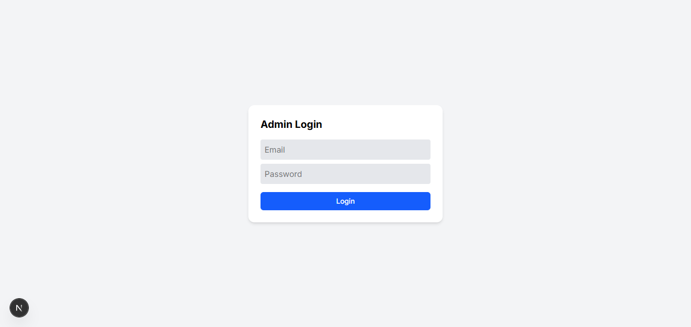
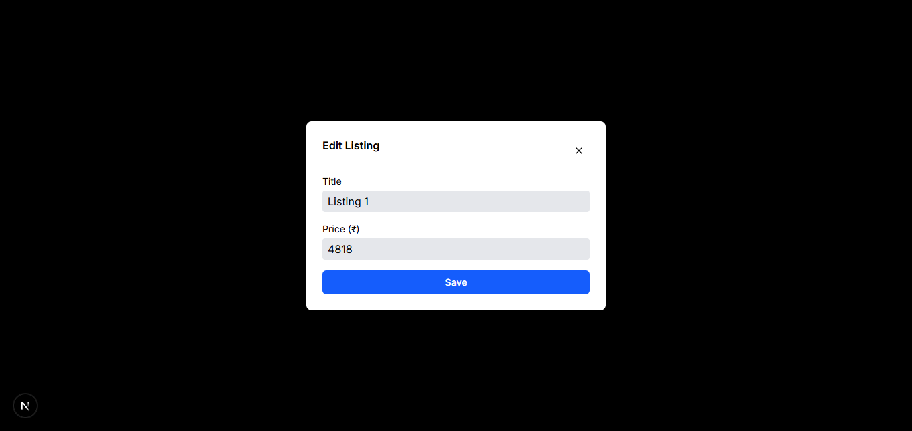
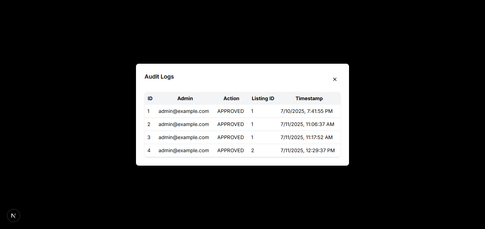

# Admin Dashboard

A modern admin dashboard built with Next.js 15, TypeScript, and Tailwind CSS for managing car rental listings, user authentication, and audit logs.

## Features

- Authentication system with secure login
- Dashboard overview with listing statistics
- Listing management with CRUD operations
- Approval workflow for listings
- Audit logs for activity tracking
- Responsive design
- TypeScript implementation

## Tech Stack

- **Framework**: Next.js 15 with App Router
- **Language**: TypeScript
- **Styling**: Tailwind CSS
- **UI Components**: Radix UI
- **Icons**: Lucide React & React Icons

## Getting Started

### Prerequisites

- Node.js 18+
- npm, yarn, or pnpm

### Installation

1. Clone the repository
   ```bash
   git clone https://github.com/iamsjunaid/admin-dashboard.git
   cd admin-dashboard
   ```

2. Install dependencies
   ```bash
   npm install
   ```

3. Run the development server
   ```bash
   npm run dev
   ```

4. Open http://localhost:3000 in your browser

### Default Login
- Username: `admin@example.com`
- Password: `password123`

## Project Structure

```
admin-dashboard/
├── app/
│   ├── api/
│   │   ├── auth/login/          # Authentication endpoints
│   │   ├── audit-logs/          # Audit log API
│   │   └── listings/            # Listing management API
│   ├── components/
│   │   ├── ui/                  # Reusable UI components
│   │   ├── AuditLogModal.tsx    # Audit log viewer
│   │   ├── EditListingModal.tsx # Listing editor
│   │   ├── ListingTable.tsx     # Main data table
│   │   └── Toast.tsx            # Notification system
│   ├── context/
│   │   └── FeedbackContext.tsx  # Global state management
│   ├── dashboard/
│   │   └── page.tsx             # Main dashboard page
│   ├── globals.css              # Global styles
│   ├── layout.tsx               # Root layout
│   └── page.tsx                 # Landing/login page
├── lib/
│   └── data.ts                  # Data types and utilities
├── utils/                       # Utility functions
└── public/                      # Static assets
```

## API Endpoints

| Endpoint | Method | Description |
|----------|--------|-------------|
| `/api/auth/login` | POST | User authentication |
| `/api/listings` | GET | Fetch all listings |
| `/api/listings/[id]` | PUT | Update specific listing |
| `/api/audit-logs` | GET | Fetch audit logs |

## Screenshots

.png>)

 
## Key Components

- **Listing Table**: Paginated table with filtering
- **Status Management**: Approve/reject listings
- **Edit Modal**: In-place editing
- **Audit Trail**: Activity history
- **Authentication**: Cookie-based sessions

## Deployment

### Render

1. Push to GitHub
2. Create account at render.com
3. Create Web Service
4. Connect repository
5. Set build command: `npm run build`
6. Set start command: `npm start`

### Vercel

```bash
npm install -g vercel
vercel
```

## Scripts

```bash
npm run dev      # Development server
npm run build    # Build for production
npm run start    # Start production server
npm run lint     # Run ESLint
```

## License

MIT License
